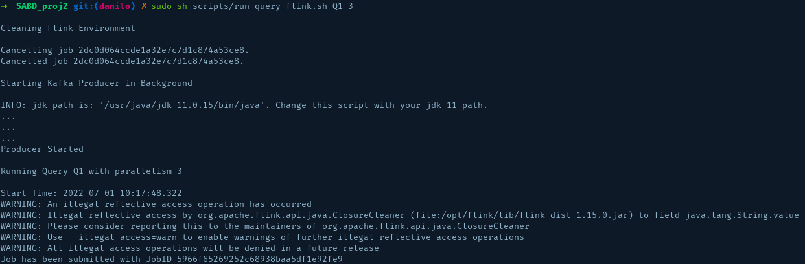
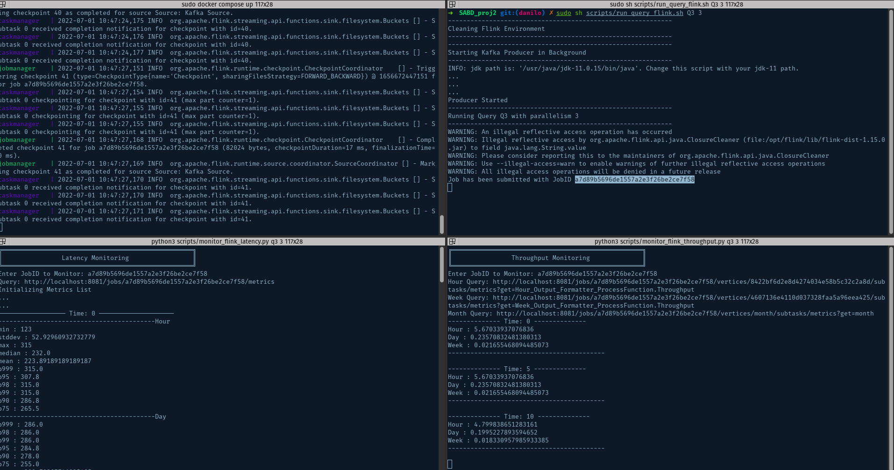

# Sistemi e Architetture per Big Data: Analisi temperatura dataset Sensor Community
Processamento di dati riferiti rilevazioni di temperatura effettuate dai sensori di *Sensor Community*, tramite i framework di *Stream Processing* **Apache Flink** e **Kafka Streams**.

Dataset:
- https://archive.sensor.community/csv_per_month/2022-05/2022-05_bmp180.zip


## Setup
* Caricare il dataset ```022-05/2022-05_bmp180``` nella directory ```/data```.

* Eseguire il build del progetto tramite Maven, spostandosi prima nella directory ```SABD_proj2/```

```bash
mvn package
```

* Effettuare il deployment dei nodi necessari tramite il tool di orchestrazione docker-compose

```bash
sudo docker-compose up
```
oppure
```bash
sudo docker compose up
```


* Terminato il setup dell'ambiente docker, è possibile eseguire singolamente le query desiderate tramite gli appositi script bash.

## Query Execution
### Flink

```bash
sudo sh scripts/run_query_flink.sh [query_name] [parallelism_level]
```
- ```query_name = Q1 / Q2 / Q3```
- ```parallelism_level = 0 ... 12```



### Kafka Streams

```bash
sudo sh scripts/run_query_kafka.sh [query_name] [parallelism_level]
```
- ```query_name = Q1 / Q2```
- ```parallelism_level = 0 ... 12```


## Risultati
I risultati delle query vengono salvati in formato ```.csv```, e sono disponibili nella cartella [results](https://github.com/michsalvv/SABD_proj2/tree/main/scripts/results) in formato ```.csv```. 

A seguito dell'esecuzione delle queries, i risultati ```.csv``` vengono salvati nei rispettivi container docker. Per importare i risultati in locale (nella cartella ```results```) si possono utilizzare i seguenti script:

### Flink
```bash
sudo sh scripts/flink_csv_to_local.sh [query_name]
```
- ```query_name = q1 / q2 / q3```

### kafka Streams
```bash
sudo sh scripts/kafka_csv_to_local.sh [query_name]
```
- ```query_name = q1 / q2```

## Monitoraggio delle Prestazioni
Per monitorare **latenza** e **throughput** dell'applicazione sono disponibili gli scripts python ```monitor_flink-latency``` e ```monitor_flink_throughput```, che permettono di tracciare le metriche nel tempo, con un intervallo di 5 secondi tra due misurazioni.

- Avviare in due terminali distinti gli script di monitoraggio
    ```bash
    python3 scripts/monitor_flink_latency.py [query_name] [parallelism_level]
    ```
    ```bash
    python3 scripts/monitor_flink_latency.py [query_name] [parallelism_level]
    ```
- Avviare in un terzo terminale la query desiderata tramite ```run_query_flink.sh```

- Copiare il ```jobID``` fornito da flink ed incollarlo nei due terminali di monitoraggio.



I risultati del monitoraggio vengono salvati in formato csv all'interno delle cartelle ```results/thorugput``` e ```results/latency```.

